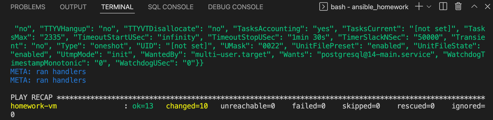

The goal of the homework is to install and run nginx and postgreSQL on a 
virtual machine. 
The host of a particular virtual machine is determined in hosts file as
homework-vm inventory. This named is used in the playbook to run all jobs.
The name of the homework playbook is `homework-playbook.yml`

The homework playbook has been run successfully.
