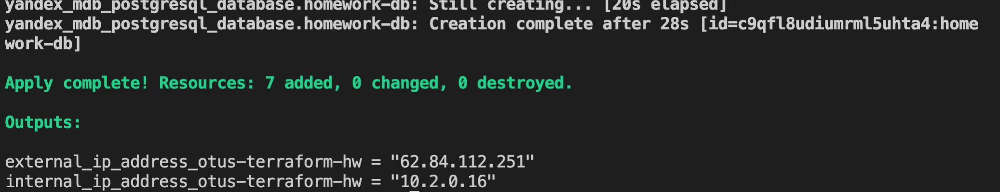
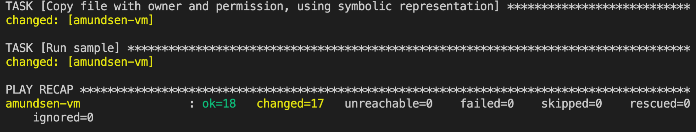
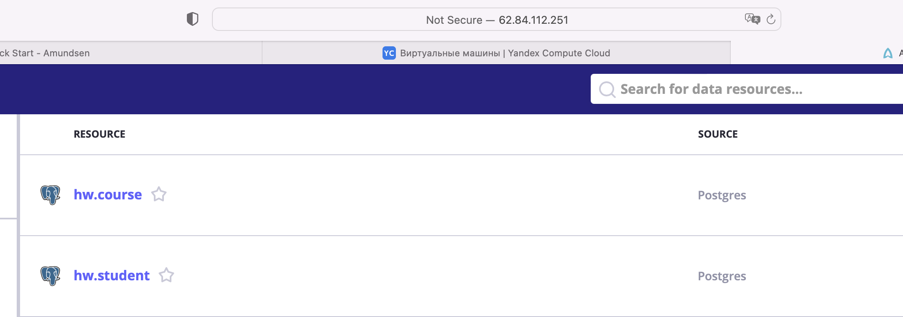
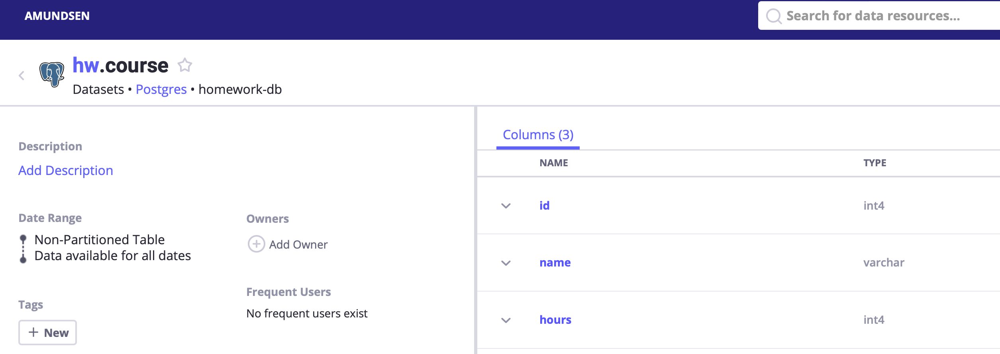
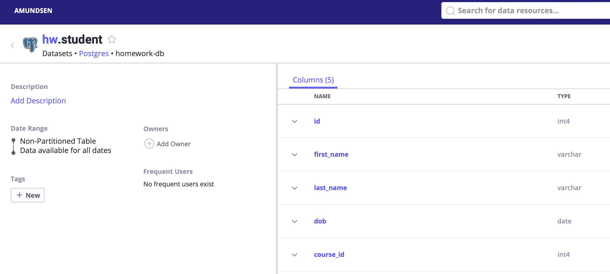

## Домашняя работа по теме Развертывание системы Data Governance

Я разделил данную работу на три этапа:

- создание облачной инфраструктуры (1 вм для amundsen и 1 БД Postgres) в `Яндекс.Облаке` с использованием [`terraform`](terraform/main.tf)

- создание в БД [`таблиц`](sample_ddl/ddl.sql)

- установка и развёртывание `Amundsen`, интеграция с БД.

После того, как создалась инфраструктура

я подключился к хранилищу из клиета, создав схему и пару таблиц.

Был использован следующий **sql** код:

```
create schema hw;

create table hw.course (
id INTEGER PRIMARY KEY UNIQUE NOT NULL,
name VARCHAR (250),
hours INTEGER
);

create table hw.student (
id INTEGER,
first_name VARCHAR(255),
last_name VARCHAR(255), 
dob DATE,
course_id INTEGER REFERENCES hw.course(id)
);

```

Далее, я указал хост вм, которая предстаначается для `Amundsen` и запустил playbook ansible. В качестве backend использовал `Neo4j`.


В качестве интеграции был использован переделанный [`скрипт`](ansible/postgres_loader.py) из нативных примеров.

В данном задании не соблюдал секьюрность, поэтому креды написал прямо в скрипте.

В результате, в UI можно увидеть информацию о таблицах из БД:




По поводу playbook ansible. При деплое вылезло несколько ошибок, к которым я придумал костыльки:

- git ругался на то, что директория другого пользователя

- - исправил: cmd: "git config --global --add safe.directory /app/amundsen"

- некорректные версии трёх (pyparsing, importlib-metadata, jinja2)
- - исправил - перезаписал c валидными для приложения версиями