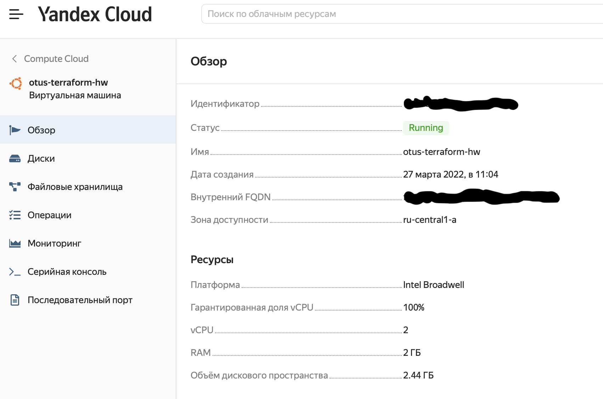

Create a Virtual Machine instance in Yandex Cloud using Terraform.

To perform the task, I have created three files:

- main.tf (configuration file)
- variables.tf (variable description file)
- secret.tfvars (file containing secrets)

To deploy the given configuration, command  `terraform apply -var-file="secret.tfvars"` has been applied.

As a result the next Virual Machine Instance was creted:
